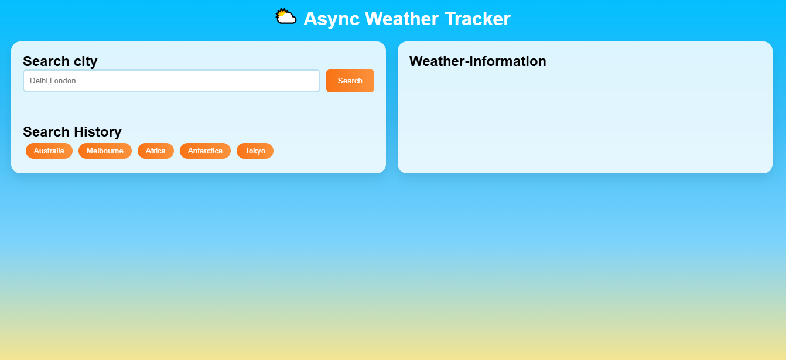

# 🌤 Async Weather Tracker

A simple and responsive weather application that allows users to search real-time weather data by city name using the OpenWeather API. Built with HTML, CSS, and JavaScript.

---

## 📸 Preview

---

## ✨ Features

- 🔍 Search weather by city name  
- 🌡 View temperature, humidity, wind speed, and conditions  
- 🕘 Search history (stored using localStorage)  
- ⚡ Asynchronous API calls using async/await  
- 📱 Fully responsive design  
- 🎨 Modern UI with gradient background  

---

## 🛠️ Tech Stack

- HTML5  
- CSS3  
- JavaScript (ES6+)  
- OpenWeather API  

---

## 📂 Project Structure
    weather-app/
    │
    ├── index.html # Main HTML file
    ├── style.css # Styling
    ├── script.js # JavaScript logic
    └── README.md # Documentation

## 🚀 Live Demo

👉 https://github.com/Anveshna2025-droid/Assignment_WebDevII
